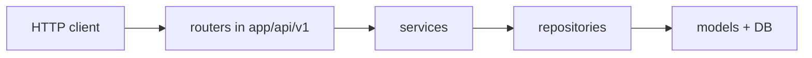

# LaunchChit (Launchit) — project layout

A FastAPI + PostgreSQL backend for developers to publish apps, gather tester feedback, comments, and upvotes/downvotes. This document lists each file’s role. Implementation lives in those modules; stubs use short comments only.....

## Request flow (mental model)

- **Routers** parse HTTP, call **services**, return **Pydantic schemas**.
- **Services** hold business rules (who can vote twice, who can delete a comment, etc.).
- **Repositories** isolate SQLAlchemy/DB access so services stay testable and thin.
- **ORM models** map to PostgreSQL tables; **Pydantic schemas** define API I/O and validation (they are not the same as ORM models).

## What you are not “missing”

| Piece | Where it lives | Role |
|--------|----------------|------|
| **Pydantic schemas** | `app/schemas/` | Request bodies, responses, and validation. Keep separate from ORM to avoid leaking DB shape into the API. |
| **ORM / DB tables** | `app/models/` | SQLAlchemy models for PostgreSQL. |
| **Migrations** | `alembic/` (add when ready) | Schema changes over time; use Alembic with async SQLAlchemy. |
| **Settings & DB URL** | `app/config/settings.py`, `app/config/database.py` | One place for env-based config and the async engine/session. |
| **Auth & errors** | `app/core/security.py`, `app/core/exceptions.py`, `app/api/dependencies.py` | Login/register, optional JWT/session, and shared `Depends()`. |
| **Tests** | `tests/` | `conftest.py` for TestClient, DB fixtures, and overrides. |

Optional later: `app/middleware/`, `app/tasks/` (Celery/ARQ for email), or `static/` for uploaded assets if you do not use object storage.

## Root

| File / folder | Purpose |
|---------------|---------|
| `pyproject.toml` | Project metadata, Python version, and dependencies (FastAPI, Uvicorn, SQLAlchemy async, asyncpg, Pydantic Settings, Alembic, etc.). |
| `main.py` | Optional local note; the ASGI app is intended to be `app.main:app` for Uvicorn. |
| `.env.example` | Copy to `.env`; documents expected variables (e.g. `DATABASE_URL`, `SECRET_KEY`). |
| `README.md` | Human-facing project intro (not replaced here). |
| `docs/FILE_STRUCTURE.md` | This file. |

## Application package: `app/`

| File | Purpose |
|------|---------|
| `app/__init__.py` | Package marker and short description. |
| `app/main.py` | Create the FastAPI `app`, add middleware, include `app/api/v1` routers, lifespan for DB pool. |

## Config: `app/config/`

| File | Purpose |
|------|---------|
| `app/config/settings.py` | Pydantic `BaseSettings` for all environment-driven options (no secrets in code). |
| `app/config/database.py` | Async engine, `async_session_maker`, and a `get_db` dependency for request-scoped sessions. |
| `app/config/__init__.py` | Re-exports so other modules can `from app.config import ...`. |

## Core: `app/core/`

| File | Purpose |
|------|---------|
| `app/core/exceptions.py` | Custom errors and a consistent way to turn them into HTTP error responses. |
| `app/core/security.py` | Hashing, JWT or session helpers, and anything security-related reused by `dependencies`. |

## Data layer: `app/models/`, `app/schemas/`, `app/repositories/`

| File / folder | Purpose |
|---------------|---------|
| `app/models/` | One module per table group (e.g. `user.py`, `app_listing.py`, `comment.py`, `vote.py`) plus relationship definitions. |
| `app/schemas/` | Pydantic models for “create app”, “comment out”, “vote result”, etc. |
| `app/repositories/` | CRUD and queries; services call repositories, not raw `Session` from routers. |

## Business logic: `app/services/`

| File / folder | Purpose |
|---------------|---------|
| `app/services/` | Rules: publishing eligibility, comment moderation hooks, vote idempotency, aggregating scores, etc. Split into e.g. `apps_service.py`, `votes_service.py` as the codebase grows. |

## HTTP API: `app/api/`

| File / folder | Purpose |
|---------------|---------|
| `app/api/dependencies.py` | Shared `Depends`: database session, optional `current_user`, rate-limit hooks later. |
| `app/api/v1/router.py` | Single `APIRouter` that `include_router`s the feature routers with prefix `/api/v1`. |
| `app/api/v1/apps.py` | Routes for published apps (list, create, get by id, update). |
| `app/api/v1/users.py` | Auth and profile (register, login, me). |
| `app/api/v1/comments.py` | Comments on an app. |
| `app/api/v1/votes.py` | Upvote/downvote (or a single net score) per user and app. |

## Tests: `tests/`

| File | Purpose |
|------|---------|
| `tests/conftest.py` | Pytest fixtures: override `get_db` with a test database or transactions, `TestClient`, seed data. |

## Database migrations (add when you start coding models)

1. `alembic init alembic` (or place `alembic/` next to `app/`) and point `env.py` at your async engine and `target_metadata` from `app.models`.  
2. Use revision scripts under `alembic/versions/` to evolve PostgreSQL without manual SQL in production.

## Install and run (after you add real `app` code)

With dependencies installed from `pyproject.toml`, run the API with Uvicorn, for example:

`uvicorn app.main:app --reload`

(Exact command may depend on your virtualenv and working directory.) Use `asyncpg` in the SQLAlchemy URL for async PostgreSQL, e.g. `postgresql+asyncpg://...`.

---

This structure keeps **settings** in `config/`, **HTTP** in `api/`, **rules** in `services/`, **DB access** in `repositories/`, **table definitions** in `models/`, and **API contracts** in `schemas/`—which matches common FastAPI best practices and scales for a Gambia- and Africa-focused app catalog and feedback system.
